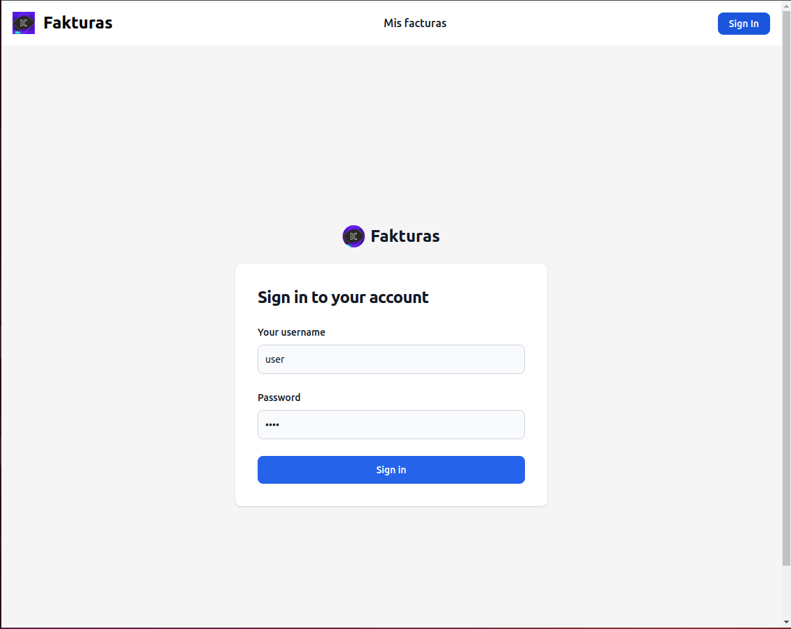
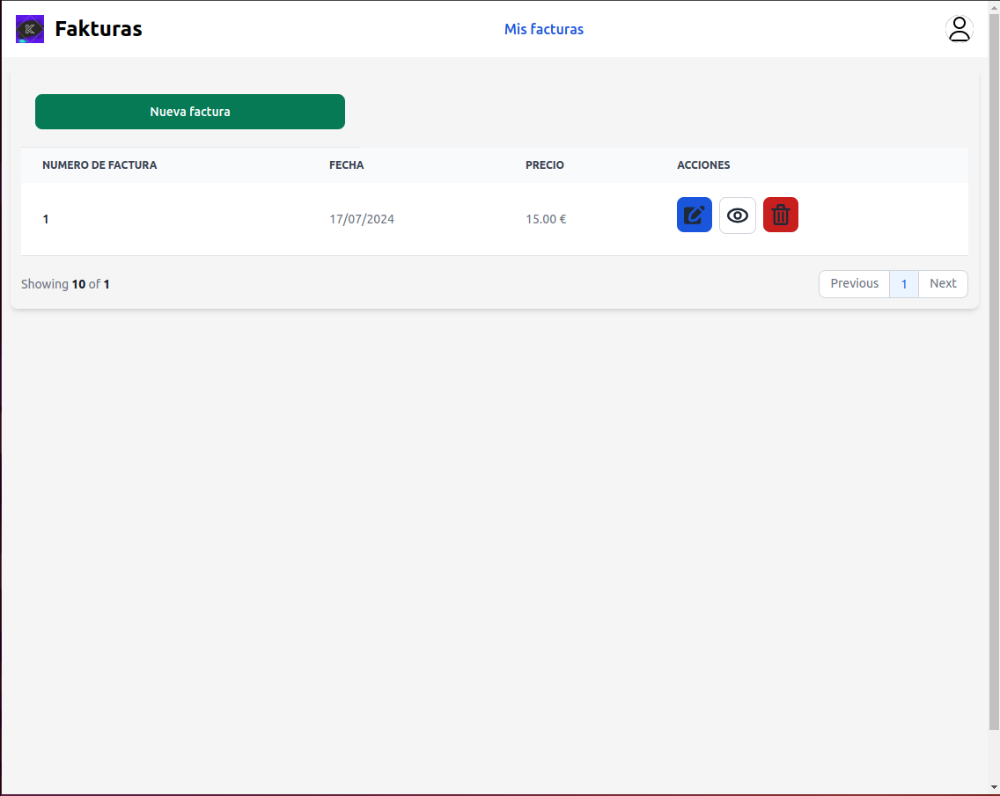
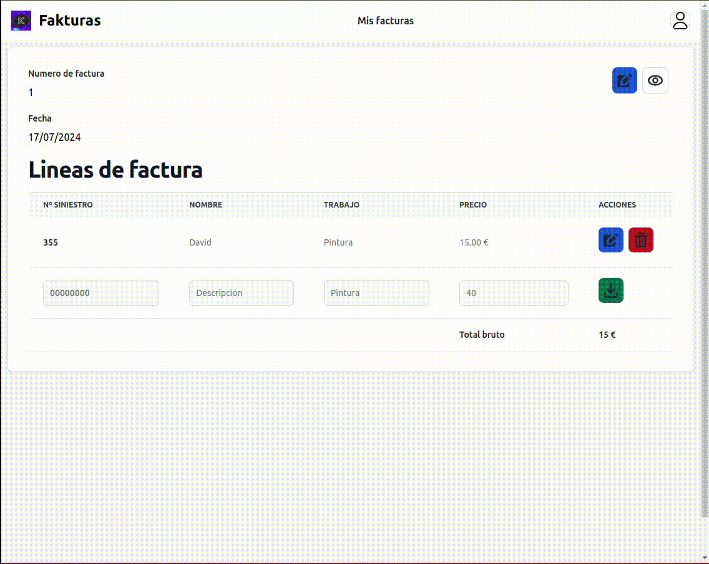
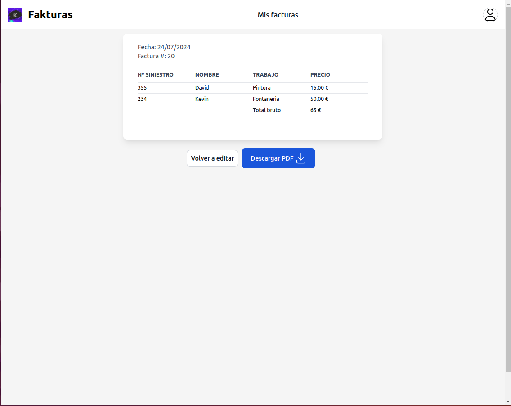
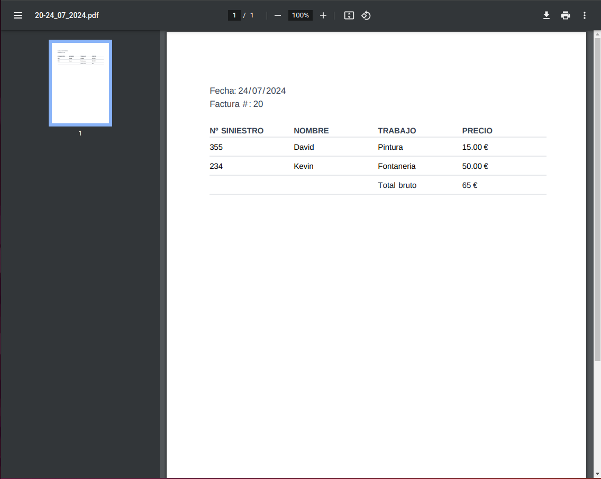

# Fakturas

Fakturas es una aplicación web para la gestión de facturas. Permite a los usuarios iniciar sesión, ver sus facturas, editar, eliminar, crear nuevas facturas y descargar las facturas en formato PDF. Al editar una factura, se pueden cambiar el número y la fecha de la factura, así como añadir líneas de ítems, con el precio calculado automáticamente.

https://fakturas.kevinposada.es/

## Tabla de Contenidos

- [Instalación](#instalación)
- [Configuracion](#configuracion-de-entorno)
- [Uso](#uso-en-desarrollo)
- [Contribución](#contribución)
- [Licencia](#licencia)

## Instalación

### Clonación del Repositorio

```bash
git clone https://github.com/kevposesp/FaKTuras.git
cd FaKTuras
```

### Instalación de Dependencias
Instalar dependencias en client y server
```bash
cd client
npm i
npm run dev
cd ..
cd server
npm i
```

## Configuracion de entorno
En el server configuraremos los archivos y los renombraremos (client/core/):
- config.ini.js -> config.js

En el server configuraremos los archivos y los renombraremos (server/config/):
- .env.example -> .env
- auth.config.ini.js -> auth.config.js
- db.config.ini.js -> db.config.js

## Uso en Desarrollo
Iniciar el cliente
```bash
cd client
npm run dev
```
Iniciar el server
```bash
cd server
npm run dev
```

## Ejemplos de uso
### Inicio de sesión
Podremos usar el usuario de pruebas
- username: user
- password: user



### Mis facturas
Tendremos la pantalla para ver todas las facturas que hay creadas.
Podremos añadir nueva factura, editar la factura, ver la factura o eliminarla.



Podremos editar cada factura y añadir los items que queramos.



Y en la vista principal de la factura podriamos volver a editarla o descargarla.



Se descargará en formato pdf y como nombre, el numero de la factura y la fecha que hemos definido anteriormente.



## Produccion
Esto lo podremos probar en https://fakturas.kevinposada.es/ con el usuario de prueba que hemos comentado antes.

## Licencia
Este proyecto se distribuye bajo la licencia MIT, lo que permite a otros usar, modificar y distribuir el software bajo los términos de dicha licencia.